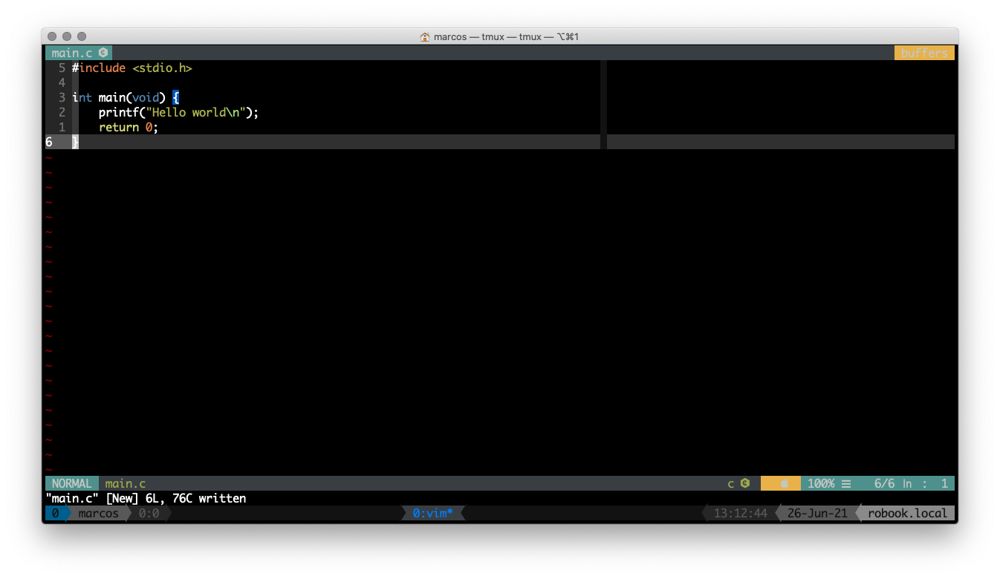

# vimrc

My minimalist configuration vim, since my tasks are more database administration I do not have so many development plugins only the basics to be able to have a minimal decent working environment.

## Requirements
| Name    | Description                                                                                                                                 |
|---------|---------------------------------------------------------------------------------------------------------------------------------------------|
| git     | Git is software for tracking changes in any set of files, usually used for coordinating work among programmers collaboratively developing source code during software development. Its goals include speed, data integrity, and support for distributed, non-linear workflows (thousands of parallel branches running on different systems).                             |

## How to install?

```bash
$ git clone --recursive https://github.com/marcos-ro/vimrc ~/.vim
```

## Preview


